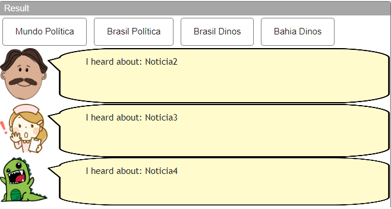
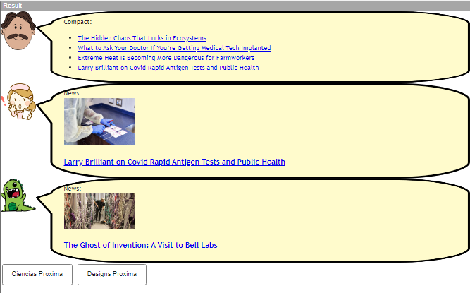
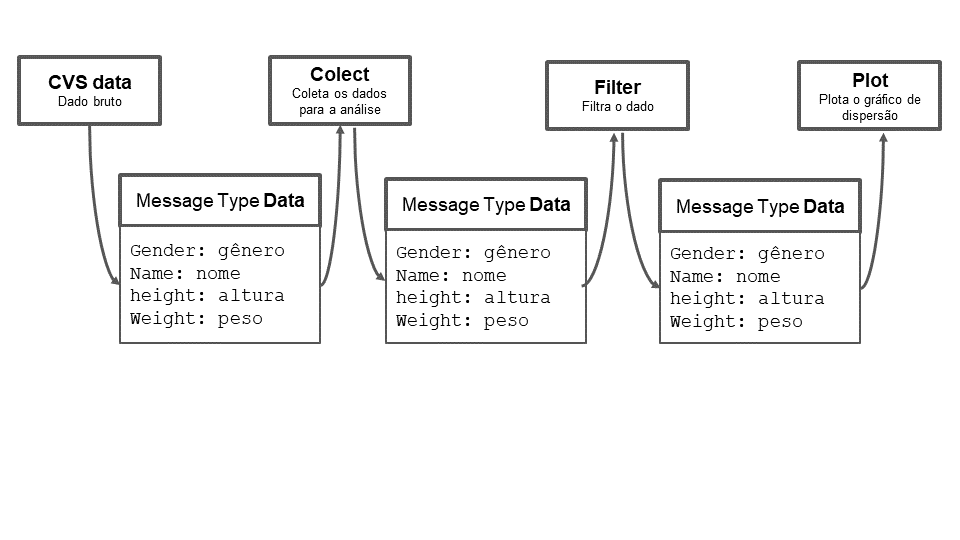

# Modelo para Apresentação do Lab01 - Estilos Arquiteturais

# Aluno
* Giuliana Cirelli - RG 29.418.252-4

## Tarefa 1 - Web Components e Tópicos

> Escreva aqui o código da sua composição de componentes Web, como mostra o exemplo a seguir:

~~~html
<dcc-button label="Mundo Política" topic="noticia/mundo/politica" message="Noticia1">
</dcc-button>
<dcc-button label=" Brasil Política" topic="noticia/brasil/politica" message="Noticia2">
</dcc-button>
<dcc-button label="Brasil Dinos" topic="noticia/brasil/dinos" message="Noticia3">
</dcc-button>
<dcc-button label="Bahia Dinos" topic="noticia/bahia/dinos" message="Noticia4">
</dcc-button>

  <dcc-lively-talk character="https://harena-lab.github.io/harena-docs/dccs/tutorial/images/doctor.png" speech="I heard about: " subscribe="noticia/#/politica:speech">
  </dcc-lively-talk>

  <dcc-lively-talk character="https://harena-lab.github.io/harena-docs/dccs/tutorial/images/nurse.png" speech="I heard about: " subscribe="noticia/brasil/#:speech">
  </dcc-lively-talk>

  <dcc-lively-talk speech="I heard about: " subscribe="noticia/+/+:speech">
  </dcc-lively-talk>

~~~

> Acrescente uma imagem da composição em funcionamento, como o exemplo a seguir:

## Tarefa 2 - Web Components e RSS
> Escreva aqui o código da sua composição de componentes Web seguida de uma imagem que captura o funcionamento, como foi feito na tarefa anterior.
~~~html
<dcc-rss source="https://www.wired.com/category/science/feed" subscribe="next/rss_c:next" topic="rss/science">
</dcc-rss>

<dcc-rss source="https://www.wired.com/category/design/feed" subscribe="next/rss_d:next" topic="rss/design">
</dcc-rss>

<dcc-aggregator topic="aggregate/science" quantity="4" subscribe="rss/science">
</dcc-aggregator>

<dcc-lively-talk character="https://harena-lab.github.io/harena-docs/dccs/tutorial/images/doctor.png" speech="Compact: " subscribe="aggregate/science:speech">
</dcc-lively-talk>

<dcc-lively-talk character="https://harena-lab.github.io/harena-docs/dccs/tutorial/images/nurse.png" speech="News: " subscribe="rss/science:speech">
</dcc-lively-talk>

<dcc-lively-talk speech="News: " subscribe="rss/design:speech">
</dcc-lively-talk>

<dcc-button label="Ciencias Proxima" topic="next/rss_c">
</dcc-button>
<dcc-button label="Designs Proxima" topic="next/rss_d">
</dcc-button>

~~~

## Tarefa 3 - Painéis de Mensagens com Timer
> Escreva aqui o código da sua composição de componentes Web seguida de uma imagem que captura o funcionamento, como foi feito na tarefa anterior.
~~~html
<dcc-rss source="https://www.wired.com/category/science/feed" subscribe="next/rss_c:next" topic="rss/science">
</dcc-rss>

<dcc-rss source="https://www.wired.com/category/design/feed" subscribe="next/rss_d:next" topic="rss/design">
</dcc-rss>

<dcc-aggregator topic="aggregate/science" quantity="3" subscribe="rss/science">
</dcc-aggregator>

<dcc-lively-talk character="https://harena-lab.github.io/harena-docs/dccs/tutorial/images/doctor.png" speech="News: topic="next/count" topic="next/count" " subscribe="rss/science:speech"> 
</dcc-lively-talk>

<dcc-lively-talk character="https://harena-lab.github.io/harena-docs/dccs/tutorial/images/nurse.png" speech="News: " subscribe="rss/design:speech"> 
</dcc-lively-talk>

<dcc-lively-talk speech="Compact: topic="next/count2" " subscribe="aggregate/science:speech"> 
</dcc-lively-talk>

<dcc-timer cycles="10" interval="1000" topic="next/rss_c" subscribe="start/timer:start">
</dcc-timer>

<dcc-timer cycles="10" interval="2000" topic="next/rss_d" subscribe="start/timer:start">
</dcc-timer>

<dcc-button label="Inicia" topic="start/timer">
</dcc-button>

~~~

## Tarefa 4 - Web Components Dataflow
> Imagem (`PNG`) do diagrama de componentes (veja exemplo abaixo).

Realizado em dupla com Mayara Fernandes
Organizamos a interface para coletar os dados brutos do arquivo CVS, filtar e depois projetar ou plotar o resultado no gráfico de disperção. Para obtermos componentes intercambiáveis, precisamos de dados padronizados. Ou seja, o input e o output de cada componente da interface deve ser o mesmo.
